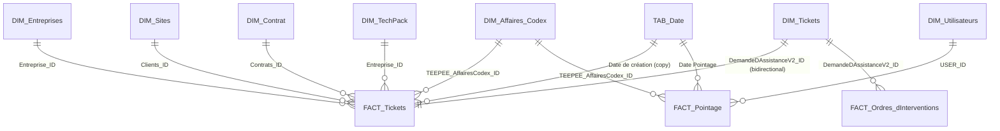

# Data model

Semantic model in **Import mode**, `fr-FR` culture, star schema centred on tickets and time entries.

## Tables

### Facts
| Table | Content | Grain |
|---|---|---|
| `FACT_Tickets` | Support requests: number, subject, dates (creation, acknowledgement, resolution, invoicing), billable hours, totals excl. tax / TGC / incl. tax, keys to company, site, project, contract | 1 row = 1 ticket |
| `FACT_Ordres_d'Interventions` | Intervention orders (OI): planned schedule, report, signatures, **control checklists** (sections 1 to 4: room, machine, environment, services), hours performed, invoicing totals | 1 row = 1 OI |
| `FACT_Pointage` | Timesheets: date, start/end times, hours worked, travel, validation, sent to Codex, hourly rate, price excl. tax | 1 row = 1 time entry |

### Dimensions
| Table | Content |
|---|---|
| `DIM_Tickets` | Ticket attributes: status, category, type, priority, manual/automatic, `QH` (hours quota) and `TP` (TechPack) flags |
| `DIM_Entreprises` | Clients: name, client number, TechPack flag |
| `DIM_Sites` | Client sites: name, address, contact |
| `DIM_Contrat` | Contracts: reference, dates (effective, notice, end), duration, status, **annual hours quota** |
| `DIM_TechPack` | TechPack bundles: count, parameter (hours), validity dates, **total hours** |
| `DIM_Utilisateurs` | Technicians: name, Codex employee number, hourly rate, on-call, licence |
| `DIM_Affaires_Codex` | Projects from Codex (ERP): project number, project type, dates, analytical unit |

### Other
- `TAB_Date` — DAX calendar (year, month, quarter, ISO week, labels…), sorted by month number.
- `Mesures` — empty table hosting the DAX measures, organised in display folders (*POINTAGES*, *QUOTA D'HEURE & TP*).

## Relationships

Notes:
- `DIM_Tickets ↔ FACT_Tickets` is a **bidirectional** 1-to-1 relationship: `DIM_Tickets` carries the descriptive attributes, `FACT_Tickets` the dates and amounts.
- Intervention orders attach to tickets through `DIM_Tickets`, which makes it possible to filter intervention hours by ticket status or category.
- `DIM_TechPack` is linked to `FACT_Tickets` through the **company** (one client, its TechPacks); the validity period is applied in the DAX measures, not in the relationship.
- The visual layout of the model is in `powerbi/Teepee_Model_2.1.SemanticModel/diagramLayout.json`.

## Power Query chain

Queries are organised in groups under **API Safeplace**:

| Group | Role | Examples |
|---|---|---|
| `00_Paramètres` | API address and credentials (per source) | `url`, `key_*`, `id_*`, `id_*_s` |
| `01_Sources_API` | One query per table exposed by the API (`SRC_Pointages`, `SRC_Tickets`, `SRC_OI`, `SRC_Contrats`, `SRC_Contrats_TP`) | `TAB_Pointage`, `TAB_Demande_d'assistance_(tickets)`, `TAB_Ordres_d'Interventions`, `TAB_Contrats`… |
| `02_Transformées` | Cleaning and enrichment (`_TSF` suffix) | `TAB_Demande_d'assistance_(tickets)_TSF`, `TAB_Ordres_d'Interventions_TSF`, `TAB_Contrats_TSF` |
| `03_Model` (`FACT`, `DIM`, `RELATIONS`) | Final tables loaded into the model + `REL_*` link tables | `FACT_Tickets`, `DIM_Contrat`, `REL_Contrat_Tickets`… |

Main transformations (query `TAB_Demande_d'assistance_(tickets)_TSF`):
- renaming of the API's technical fields to business labels (`NumeRoDeTicket` → `Numéro de ticket`…);
- translation of codes: *manual/automatic* (0/1), **statuses** (`EnCours` → *Prise en compte*, `AFacture` → *A Facturé*…), **categories** (BUILD, RUN, INFOGERANCE, BUSINESS, SERVICES, CONGES / FERIE / MALADIE, NOUVELLE DEMANDE), **priorities** (Majeur / Mineur / Non urgent);
- exclusion of tickets whose manual/automatic mode is empty;
- joins with the `REL_*_Tickets` tables (company, site, priority, project, contract) to obtain the foreign keys;
- duplication of the creation date as a *date* type for the relationship with `TAB_Date`.

`FACT_Tickets` and `DIM_Tickets` are two projections of the same `_TSF` query (different columns removed).

A diagnostic query `Erreurs dans DIM_Utilisateurs` (group *Erreurs des requêtes*) lists the type inconsistencies detected during a load; it is not loaded into the model.
