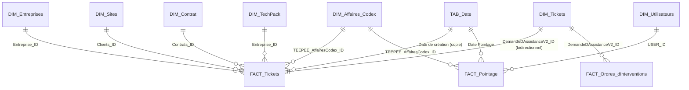

# Modèle de données

Modèle sémantique en **mode Import**, culture `fr-FR`, schéma en étoile centré sur les tickets et les pointages.

## Tables

### Faits
| Table | Contenu | Grain |
|---|---|---|
| `FACT_Tickets` | Demandes d'assistance : numéro, objet, dates (création, prise en compte, résolution, facturation), heures facturables, totaux HT / TGC / TTC, clés vers entreprise, site, affaire, contrat | 1 ligne = 1 ticket |
| `FACT_Ordres_d'Interventions` | Ordres d'intervention (OI) : planning prévisionnel, compte rendu, signatures, **check-lists de contrôle** (sections 1 à 4 : local, machine, environnement, services), heures réalisées, totaux de facturation | 1 ligne = 1 OI |
| `FACT_Pointage` | Feuilles de temps : date, heures début/fin, heures travaillées, déplacement, validation, envoi vers Codex, taux horaire, prix HT | 1 ligne = 1 pointage |

### Dimensions
| Table | Contenu |
|---|---|
| `DIM_Tickets` | Attributs des tickets : statut, catégorie, type, priorité, manuel/automatique, indicateurs `QH` (quota d'heures) et `TP` (TechPack) |
| `DIM_Entreprises` | Clients : nom, numéro client, indicateur TechPack |
| `DIM_Sites` | Sites clients : nom, adresse, contact |
| `DIM_Contrat` | Contrats : référence, dates (effet, préavis, fin), durée, statut, **quota d'heures / an** |
| `DIM_TechPack` | Forfaits TechPack : nombre, paramètre (heures), dates de validité, **heures totales** |
| `DIM_Utilisateurs` | Techniciens : nom, matricule Codex, taux horaire, astreinte, licence |
| `DIM_Affaires_Codex` | Affaires issues de Codex (ERP) : numéro d'affaire, type de projet, dates, unité analytique |

### Autres
- `TAB_Date` — calendrier DAX (année, mois, trimestre, semaine ISO, libellés…), trié par numéro de mois.
- `Mesures` — table vide qui héberge les mesures DAX, rangées par dossiers d'affichage (*POINTAGES*, *QUOTA D'HEURE & TP*).

## Relations

Notes :
- `DIM_Tickets ↔ FACT_Tickets` est une relation 1-1 **bidirectionnelle** : `DIM_Tickets` porte les attributs descriptifs, `FACT_Tickets` les dates et montants.
- Les ordres d'intervention se rattachent aux tickets via `DIM_Tickets`, ce qui permet de filtrer les heures d'intervention par statut ou catégorie de ticket.
- `DIM_TechPack` est reliée à `FACT_Tickets` via l'**entreprise** (un client, ses forfaits TechPack) ; la période de validité est appliquée dans les mesures DAX, pas dans la relation.
- La disposition visuelle du modèle est dans `powerbi/Teepee_Model_2.1.SemanticModel/diagramLayout.json`.

## Chaîne Power Query

Les requêtes sont organisées en groupes sous **API Safeplace** :

| Groupe | Rôle | Exemples |
|---|---|---|
| `00_Paramètres` | Adresse de l'API et identifiants (par source) | `url`, `key_*`, `id_*`, `id_*_s` |
| `01_Sources_API` | Une requête par table exposée par l'API (`SRC_Pointages`, `SRC_Tickets`, `SRC_OI`, `SRC_Contrats`, `SRC_Contrats_TP`) | `TAB_Pointage`, `TAB_Demande_d'assistance_(tickets)`, `TAB_Ordres_d'Interventions`, `TAB_Contrats`… |
| `02_Transformées` | Nettoyage et enrichissement (suffixe `_TSF`) | `TAB_Demande_d'assistance_(tickets)_TSF`, `TAB_Ordres_d'Interventions_TSF`, `TAB_Contrats_TSF` |
| `03_Model` (`FACT`, `DIM`, `RELATIONS`) | Tables finales chargées dans le modèle + tables de liaison `REL_*` | `FACT_Tickets`, `DIM_Contrat`, `REL_Contrat_Tickets`… |

Principales transformations (requête `TAB_Demande_d'assistance_(tickets)_TSF`) :
- renommage des champs techniques de l'API en libellés métier (`NumeRoDeTicket` → `Numéro de ticket`…) ;
- traduction des codes : *manuel/automatique* (0/1), **statuts** (`EnCours` → *Prise en compte*, `AFacture` → *A Facturé*…), **catégories** (BUILD, RUN, INFOGERANCE, BUSINESS, SERVICES, CONGES / FERIE / MALADIE, NOUVELLE DEMANDE), **priorités** (Majeur / Mineur / Non urgent) ;
- exclusion des tickets dont le mode manuel/automatique est vide ;
- jointures avec les tables `REL_*_Tickets` (entreprise, site, priorité, affaire, contrat) pour obtenir les clés étrangères ;
- duplication de la date de création en type *date* pour la relation avec `TAB_Date`.

`FACT_Tickets` et `DIM_Tickets` sont deux projections de la même requête `_TSF` (colonnes différentes supprimées).

Une requête de diagnostic `Erreurs dans DIM_Utilisateurs` (groupe *Erreurs des requêtes*) liste les incohérences de types détectées lors d'un chargement ; elle n'est pas chargée dans le modèle.
